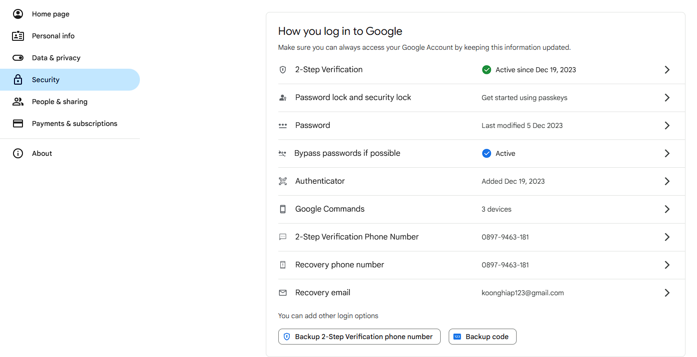

# BeauSkin Cloud Computing Backend

BeauSkin is an AI-powered skin analysis service that provides automated assessment of skin conditions, acne detection, and skin type classification using machine learning models.

This repository is contain all api access in the application except api contain model.

## Setup Instructions

### Clone the Project

```bash
https://github.com/Bangkit-Beauskin/cloud-computing-backend.git
cd cloud-computing-backend
```

### Prerequisites

- Node js 20 or higher
- Google Email

### GCP Settings

#### Cloud Storage

- login to your google cloud platfrom account
- search buckets and click buckets option

- click CREATE to create new buckets
- choose where to store your data to region and choose where you want store data


- choose how to control access to objects
- uncheck enforce public access and set access control to fine-grained


- click your bucket name in list of bucket
- click permissions option
- click GRANT ACCESS
- in new perincipals choose allUsers
- in role choose storage object viewer


- open file main.py change code bucket_name to your bucket name
  

#### Firestore

- search firestore
- click CREATE DATABASE
- choose Native mode for Firestore mode and let the others remain as default.


- click CONTINUE

#### Service Account

- search Service Accounts
- click CREATE SERVICE ACCOUNT to create new service account
- add bucket name and click CREATE AND CONTINUE
- Select a role and storage object admin, storage admin and Firebase admin


- click CONTINUE and DONE
- in right side actions button click manage keys
- click ADD KEY and create new key
- select type json and create
- you will downloaded the service account key
- copy paste the service account key in root project folder
- open file `src/db.ts` and change project id with your project id


### Google SMTP Settings

- go to your google email and click manage your account
- choose security option and find 2-step verification



- login and click application password
  

- add your application name (make sure it same with your application name in package.json) and click for
- copy your application password to env file and paste in SMTP_PASSWORD
- change SMTP_USERNAME with your google email

### Installation

1. download package and adding node module

```bash
npm i
```

### Project Structure

```
beauskin-cloud-computing/
├── src            # Project Directory
    ├── @types          # Types folder for all typescript data type file
    ├── config          # Config folder for all configuration data
    ├── controller      # Controller folder for controller file
    ├── middleware      # Middleware folder for file to set middleware
    ├── routes          # Route folder for all routing file path
    ├── services        # Service folder for service file to
    ├── utils           # Helper folder for helper file
    ├── app.ts          # Express js applicaton files
    ├── db.ts           # Connection Firestore database file
    └── index.ts        # Express js server file
├── nodemon.json        # Nodemon file for running in development version
├── package-locak.json  # Node.js package-lock file
├── package.json        # Node.js package file
└── tsconfig.json       # Typescript configuration file
```

### Running the Project

1. Make sure you downloaded Node.js
2. Make sure you have .env file (you can copy and edit env file)
3. to run application run in terminal `npm run build` and `npm run start`

4. Access the API:

   - API Documentation: [api documentation](https://www.apidog.com/apidoc/shared-fefacd0c-68f8-477a-9153-483acd88fdec)
   - Base URL: `http://localhost:4000`

5. To deactivate the application type in comment:

```bash
ctrl + C
```

## API Endpoints

| Endpoint                    | Method | Query Params         | Body            | Description                           |
| --------------------------- | ------ | -------------------- | --------------- | ------------------------------------- |
| /api/v1/auths/verify-otp    | POST   | -                    | otp             | API to verify OTP                     |
| /api/v1/auths/login         | POST   | -                    | email, password | API to login                          |
| /api/v1/auths/register      | POST   | -                    | emil, password  | API to create new account             |
| /api/v1/auths/refresh-token | POST   | -                    | -               | API to generate new access token      |
| /api/v1/profiles/           | GET    | -                    | -               | API to get profile data               |
| /api/v1/profiles/           | POST   | -                    | file,username   | API to create and update profile data |
| /api/v1/products            | GET    | page, row, skin_type | -               | API to get list of product data       |
| /api/v1/products/{id}       | GET    | id                   | -               | API to get product detail data        |

## Development

For development purposes, use `npm run start:dev` it enable hot reloading, which automatically updates the server when code changes are detected.

## Contributing

1. Fork the repository
2. Create your feature branch (`git checkout -b feature/AmazingFeature`)
3. Commit your changes (`git commit -m 'Add some AmazingFeature'`)
4. Push to the branch (`git push origin feature/AmazingFeature`)
5. Open a Pull Request

## Troubleshooting

If you encounter any issues:

1. Check if `npm i` are run correctly
2. Ensure the required ports are not in use
3. Verify that the google email SMTP settings correctly
4. Verify that the Cloud Storage Admin permission has been added to the service account.
5. Ensure that the service account key path is correct.

For any additional issues, please open an issue in the GitHub repository.
